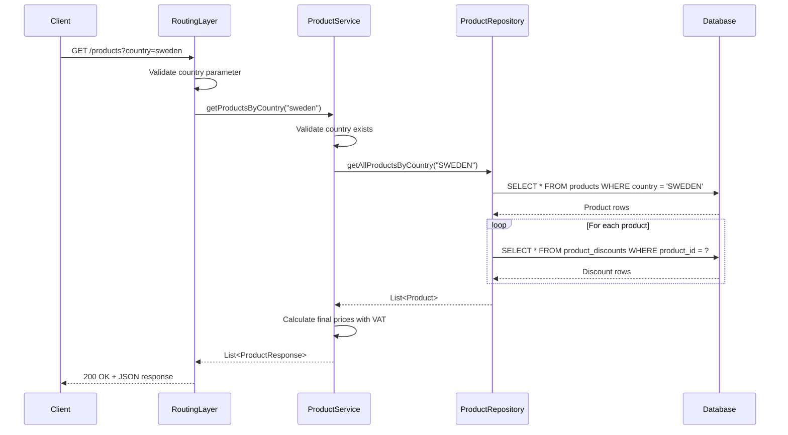
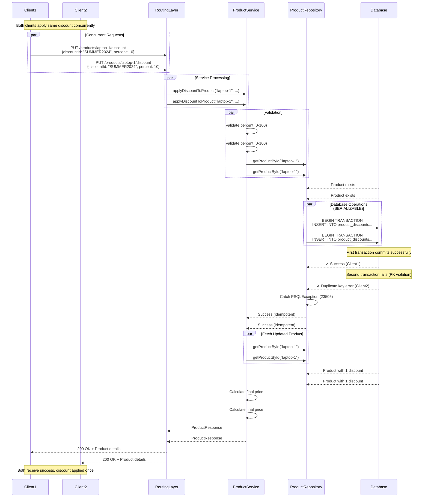

# Architecture Documentation

## Overview

This document describes the architecture and design decisions for the Discount-Based Product API, with a focus on concurrency safety and idempotent operations.

## System Architecture

### High-Level Architecture

```
┌─────────────┐
│   Client    │
└──────┬──────┘
       │ HTTP/JSON
       ▼
┌─────────────────────────────────────┐
│         Ktor Application            │
│  ┌───────────────────────────────┐  │
│  │    Routing Layer              │  │
│  │  - GET /products              │  │
│  │  - PUT /products/{id}/discount│  │
│  └──────────┬────────────────────┘  │
│             │                        │
│  ┌──────────▼────────────────────┐  │
│  │    Service Layer              │  │
│  │  - Business Logic             │  │
│  │  - Price Calculation          │  │
│  │  - Validation                 │  │
│  └──────────┬────────────────────┘  │
│             │                        │
│  ┌──────────▼────────────────────┐  │
│  │    Repository Layer           │  │
│  │  - Data Access                │  │
│  │  - Transaction Management     │  │
│  └──────────┬────────────────────┘  │
└─────────────┼────────────────────────┘
              │
              ▼
┌─────────────────────────────────────┐
│         PostgreSQL Database         │
│  ┌─────────────┐  ┌──────────────┐ │
│  │  Products   │  │   Product    │ │
│  │    Table    │  │  Discounts   │ │
│  │             │  │    Table     │ │
│  └─────────────┘  └──────────────┘ │
└─────────────────────────────────────┘
```

## Sequence Diagrams

### GET /products?country={country}



### PUT /products/{id}/discount




## Design Decisions

### 1. Layered Architecture

**Layers:**
- **Routing Layer**: HTTP request handling, parameter extraction
- **Service Layer**: Business logic, validation, price calculation
- **Repository Layer**: Database operations, transaction management
- **Database Layer**: Data persistence with PostgreSQL

**Benefits:**
- Clear separation of concerns
- Easy to test each layer independently
- Scalable and maintainable

### 2. Concurrency Strategy

#### Problem Statement
Multiple clients may attempt to apply the same discount to a product simultaneously, creating a race condition.

#### Solution: Database-Level Constraints + SERIALIZABLE Isolation

**Three-Tier Defense:**

1. **Composite Primary Key**
   ```sql
   PRIMARY KEY (product_id, discount_id)
   ```
    - Prevents duplicate discount entries at the database level
    - PostgreSQL enforces uniqueness atomically

2. **SERIALIZABLE Isolation Level**
   ```kotlin
   transactionIsolation = "TRANSACTION_SERIALIZABLE"
   ```
    - Strongest isolation level
    - Transactions appear to execute sequentially
    - Prevents phantom reads and write skew

3. **Idempotent API Design**
   ```kotlin
   try {
       ProductDiscounts.insert { ... }
       return true
   } catch (e: ExposedSQLException) {
       if (isPrimaryKeyViolation(e)) {
           return false  // Already applied - no error
       }
       throw e
   }
   ```
    - Duplicate discount attempts return success without side effects
    - Client receives 200 OK regardless

**Why Not In-Memory Solutions?**
- In-memory locks (ConcurrentHashMap, synchronized) don't survive restarts
- Can't scale horizontally with multiple application instances
- Database is the single source of truth

### 3. Price Calculation

**Formula Implementation:**
```kotlin
finalPrice = basePrice × (1 - totalDiscount%) × (1 + VAT%)
```

**Process:**
1. Sum all discount percentages for the product
2. Apply total discount to base price
3. Apply country-specific VAT to discounted price

**Example:**
```
Product: Laptop
Base Price: 1000
Discounts: 10% + 5% = 15%
Country: Germany (19% VAT)

Calculation:
1. After discount: 1000 × (1 - 0.15) = €850
2. After VAT: 850 × 1.19 = 1011.50
```
## Key Technical Decisions

### PostgreSQL SERIALIZABLE Isolation

**Why SERIALIZABLE?**
- Prevents all concurrency anomalies (dirty reads, non-repeatable reads, phantom reads, write skew)
- Ensures transactions execute as if they were sequential
- Critical for financial data integrity

**Trade-offs:**
- Slightly lower throughput compared to READ COMMITTED
- May cause transaction retries under high contention
- Acceptable for discount operations (not high-frequency)

## Scalability Considerations

### Horizontal Scaling

The architecture supports horizontal scaling:

1. **Stateless Application**: No in-memory state
2. **Database-Backed**: All state in PostgreSQL
3. **Load Balancer Ready**: Multiple instances can run concurrently

```
┌──────────┐
│  Client  │
└────┬─────┘
     │
┌────▼──────────┐
│ Load Balancer │
└───┬───────┬───┘
    │       │
┌───▼───┐ ┌─▼─────┐
│ App 1 │ │ App 2 │
└───┬───┘ └─┬─────┘
    │       │
    └───┬───┘
        │
  ┌─────▼─────┐
  │ PostgreSQL│
  └───────────┘
```

### Performance Optimization Opportunities

1. **Database Indexing**
    - Index on `country` column for faster queries
    - Composite index on `(product_id, discount_id)` already exists

2. **Connection Pooling**
    - HikariCP configured with optimal pool size
    - Reduces connection overhead

3. **Caching** (Future Enhancement)
    - Cache country VAT rates (rarely change)
    - Cache product catalog with short TTL

## Testing Strategy

### Concurrency Testing

The test suite includes:

1. **Idempotency Test**: Same discount applied 10 times concurrently
2. **Multiple Discounts Test**: Different discounts applied concurrently
3. **Verification**: Database state checked after concurrent operations

## Security Considerations

1. **SQL Injection**: Prevented by Exposed ORM parameterized queries
2. **Input Validation**: All inputs validated at service layer
3. **Error Messages**: Generic errors to clients, detailed logs server-side

## Conclusion

This architecture provides:
-  Guaranteed idempotency
-  Race condition prevention
-  Data integrity
-  Horizontal scalability
-  Maintainable codebase
-  Comprehensive testing

The use of PostgreSQL SERIALIZABLE isolation and composite primary keys ensures that concurrent discount applications are handled correctly without complex application-level locking mechanisms.
